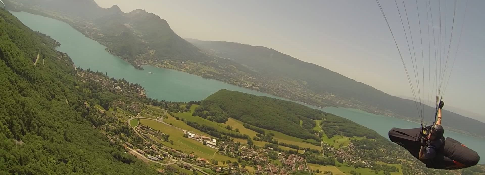

<h1 align="center">Preflight</h1>
<h3 align="center">a paragliding flight planning tool</h2>

<!--

-->

Preflight is currently at early design stage and is intended as a tool to assist paraglider pilots in coordinating their flight plans and general logistics around cross-country flight planning

While version 1 will be built using React, the intention is to rebuild the app in Svelte or Vue after the first version is complete, to gain experience in this process and better evaluate the relative pros and cons of these libraries.

## Planned features
- match users with other pilots likely to be flying from the same launch site, 
- assists in recognition of other pilots both in the air and on the ground, 
- coordination of transport to launch and pickups after landing. 
- simplify submission of [CANP](https://www.bhpa.co.uk/documents/safety/canp/) reports to reduce potential conflict with military air traffic.
- ease the sharing of electronic conspicuity details (FLARM, etc).
- flight logging and replay from tracklog data.
- Integration of [RASP](http://rasp.stratus.org.uk/index.php/rasptable-desktop), Leonardo, [XC Contest](https://www.xcontest.org/world/en/) and [Ayvri](https://ayvri.com/).
